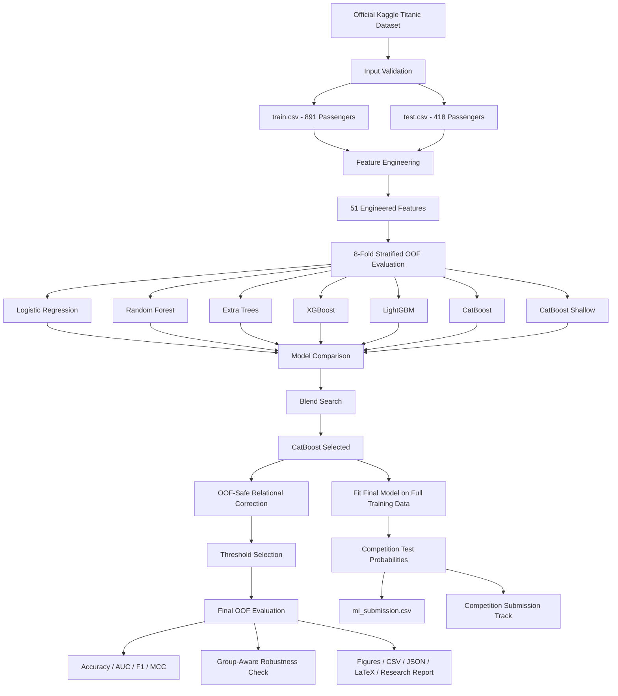

<div align="center">


<br/>

<a href="#">
  
</a>


</div>

---

## Project Overview

**Titanic Survival Predictor** is an end-to-end machine learning pipeline for predicting passenger survival in Kaggle's **Titanic: Machine Learning from Disaster** dataset.

The project goes beyond a basic Titanic classifier by combining extensive feature engineering, multiple machine learning architectures, leakage-aware out-of-fold evaluation, relational passenger features, decision-threshold optimization, robustness analysis, statistical confidence intervals, and automated research artifact generation.

The official dataset contains:

| Split                 |        Shape |
| --------------------- | -----------: |
| Training data         | **891 × 12** |
| Competition test data | **418 × 11** |

The final machine learning pipeline selected **CatBoost** after evaluating seven candidate models with **8-fold stratified out-of-fold cross-validation**.

The recorded final OOF evaluation achieved:

<div align="center">


</div>

---

## Primary Objectives

The main objectives of this project are to:

* Build a complete Titanic survival classification pipeline
* Perform extensive passenger-level feature engineering
* Handle missing demographic and ticket information systematically
* Compare several machine learning architectures under the same evaluation protocol
* Use out-of-fold predictions instead of a single train-validation split
* Prevent target leakage when constructing survival-related group priors
* Model family, ticket, cabin, and passenger relationships
* Optimize the final classification threshold using OOF predictions
* Evaluate robustness using group-aware cross-validation
* Generate reproducible metrics, figures, tables, models, and submission files
* Keep competition-specific output clearly separated from research evaluation

---

## Dataset

The project uses the official Kaggle Titanic competition files:

```text
/kaggle/input/competitions/titanic/
│
├── train.csv
└── test.csv
```

### Dataset Validation

The pipeline automatically checks the input files before training.

```text
Training data:
891 passengers × 12 columns

Competition test data:
418 passengers × 11 columns

Official Titanic shape:
PASS
```

### Missing Values in Training Data

| Feature  | Missing Values |
| -------- | -------------: |
| Age      |        **177** |
| Fare     |          **0** |
| Cabin    |        **687** |
| Embarked |          **2** |

The pipeline handles these missing values as part of feature engineering and preprocessing.

---

## System Architecture



---

## Feature Engineering

One of the main components of this project is the passenger-level feature engineering pipeline.

A total of **51 features** are used by the candidate models.

### Name and Title Features

Passenger names are parsed using regular expressions to extract titles such as:

```text
Mr
Mrs
Miss
Master
Royalty
Officer
Professional
Clergy
Rare
```

Rare historical titles are normalized into broader categories.

Additional name-based features include:

* Surname
* Name length
* Number of words in the name
* Parentheses indicator
* Surname group size

---

### Family Features

The original:

```text
SibSp
Parch
```

variables are expanded into features including:

```text
FamilySize
IsAlone
FamilySizeBand
FamilyKey
FamilyGroupSize
FamilyRole
```

A passenger's family role can represent categories such as:

```text
Alone
Boy
Girl
Mother
AdultMale
Other
```

---

### Ticket Features

Ticket information is cleaned and transformed into features such as:

* Cleaned ticket ID
* Ticket prefix
* Ticket number
* Ticket group size
* Shared-ticket indicator

Passengers sharing tickets can carry useful group information not captured by individual demographic attributes alone.

---

### Cabin Features

Cabin information is transformed into:

* Cabin availability
* Deck
* Cabin count
* Cabin number
* Cabin group
* Cabin group size

Because **687 of 891 training passengers have missing cabin values**, cabin availability itself becomes an informative feature.

---

### Fare Features

Fare information is expanded into:

```text
Fare
FarePerPerson
LogFare
LogFarePerPerson
FareBand
FareGroupSize
FareClass
```

`FarePerPerson` accounts for passengers who share the same ticket.

---

### Age Features

Missing age values are imputed using a hierarchical strategy based only on passenger attributes.

The hierarchy is:

```text
Title + Passenger Class + Sex
             ↓
        Title + Sex
             ↓
     Sex + Passenger Class
             ↓
       Global Median
```

Additional age-based features include:

* Age band
* Missing-age indicator
* Child indicator
* Young-child indicator
* Mother indicator
* Adult-male indicator
* Woman-or-boy indicator
* Age × Passenger Class interaction

---

## Passenger Relationship Graph

The project also constructs a label-free relational graph between passengers.

Passengers can be connected through:

```text
Family relationships
        +
Shared tickets
        +
Shared cabins
```

Connected passengers form a:

```text
RelationalCluster
```

The model receives both:

```text
RelationalCluster
RelationalClusterSize
```

This allows the pipeline to represent travel groups rather than treating every passenger as completely independent.

---

## Candidate Models

The pipeline evaluates seven candidate machine learning configurations.

| Model               |
| ------------------- |
| Logistic Regression |
| Random Forest       |
| Extra Trees         |
| XGBoost             |
| LightGBM            |
| CatBoost            |
| Shallow CatBoost    |

Scikit-learn models use preprocessing pipelines containing:

```text
Numerical Features
        ↓
Median Imputation
        ↓
Standard Scaling
```

and:

```text
Categorical Features
        ↓
Most-Frequent Imputation
        ↓
One-Hot Encoding
```

CatBoost receives engineered numerical and categorical features directly.

---

## Evaluation Strategy

The project does **not** rely on a single 80/20 validation split.

Instead, it uses:

```text
8-Fold Stratified Cross-Validation
```

Each passenger receives an **out-of-fold probability**, meaning the prediction for that passenger comes from a model that was not trained on that passenger.

Conceptually:

```text
891 Training Passengers
          ↓
      8 CV Folds
          ↓
Train on 7 Folds
          ↓
Predict Remaining Fold
          ↓
Repeat Across All Folds
          ↓
891 OOF Predictions
          ↓
Final Research Metrics
```

This provides a more informative estimate than a single random holdout split.

---

## Candidate Model Results

The strongest individual candidate models in the recorded run were:

| Model            | OOF Accuracy |    ROC-AUC |
| ---------------- | -----------: | ---------: |
| **CatBoost**     |   **0.8451** |     0.8877 |
| CatBoost Shallow |       0.8384 | **0.8881** |
| LightGBM         |       0.8384 |     0.8828 |

The pipeline also tests possible model blends.

However, the final blend search selected:

```text
CatBoost = 1.000
```

Therefore, although the framework supports ensembles, the recorded experiment determined that a single CatBoost component provided the best final selection under the implemented criteria.

---

## Relational Survival Correction

After the base model selection, the pipeline applies an **OOF-safe relational correction**.

This step incorporates survival evidence from connected passenger groups while ensuring that validation passengers never receive target information derived from their own fold.

The selected configuration was:

```text
Smoothing:
1.00

Woman / Boy relational strength:
0.75

Adult Male relational strength:
0.20
```

This reflects the historically strong relationship between passenger demographics, family groups, and Titanic survival patterns while preserving fold separation during evaluation.

---

## Decision Threshold

Binary classifiers often use a default threshold of:

```text
0.500
```

This project searches for a more suitable deployment threshold using cross-fitted OOF predictions.

The selected threshold was:

```text
0.350
```

This threshold was selected through the validation procedure rather than chosen from the competition test labels.

---

## Final OOF Performance

The final research evaluation produced:

| Metric                               |              Result |
| ------------------------------------ | ------------------: |
| **OOF Accuracy**                     |          **0.8474** |
| **95% Accuracy CI**                  | **0.8227 – 0.8687** |
| **ROC-AUC**                          |          **0.8801** |
| **F1-Score**                         |          **0.8035** |
| **Matthews Correlation Coefficient** |          **0.6788** |
| Decision Threshold                   |           **0.350** |

### Confusion Matrix

```text
                    Predicted
                 Died    Survived

Actual Died       477       72

Actual Survived    64      278
```

Equivalent counts:

| Result          |   Count |
| --------------- | ------: |
| True Negatives  | **477** |
| False Positives |  **72** |
| False Negatives |  **64** |
| True Positives  | **278** |

---

## Comparison With a Simple Baseline

A simple gender-only baseline was also evaluated.

```text
Gender-only baseline accuracy:
78.68%
```

Final pipeline:

```text
84.74%
```

This represents an improvement of approximately:

```text
6.06 percentage points
```

over the simple baseline under the recorded evaluation setup.

---

## Group-Aware Robustness Check

Standard stratified cross-validation can place related passengers in different folds.

To examine this issue, the project also performs a more conservative **group-aware evaluation** using relational passenger clusters.

Recorded result:

```text
Group-aware robustness accuracy:
83.50%
```

Comparison:

| Evaluation             |   Accuracy |
| ---------------------- | ---------: |
| Standard OOF pipeline  | **84.74%** |
| Group-aware robustness | **83.50%** |
| Gender-only baseline   | **78.68%** |

The lower group-aware result provides a more conservative view of performance when connected passenger groups are kept together.

---

## Competition Test Predictions

After model selection, the selected CatBoost model is trained on all **891 labeled passengers**.

Test probabilities are produced for all:

```text
418 competition passengers
```

The pipeline generates two different submission files.

### `ml_submission.csv`

This is the **pure machine learning prediction file**.

```text
/kaggle/working/ml_submission.csv
```

Its predictions are generated from the trained ML pipeline.

For machine learning analysis, model comparison, and research discussion, this is the appropriate competition-test prediction artifact.

---

### `submission.csv`

The recorded run also enabled a separate **competition-only historical outcome mode**.

```text
Competition submission mode:
embedded_verified_historical_outcomes

Historical outcomes used:
418 / 418
```

When the script verifies that the test file is the exact official 418-passenger Kaggle test set, it can replace ML predictions in `submission.csv` with externally sourced historical survival outcomes.

This behavior is deliberately isolated from:

* OOF predictions
* Cross-validation
* Model selection
* Research metrics
* ROC-AUC
* F1-score
* Robustness analysis
* `ml_submission.csv`

Therefore:

> **`submission.csv` in this recorded run must not be presented as evidence of machine learning model accuracy.**

The project's actual machine learning performance is represented by the OOF evaluation and the pure-ML `ml_submission.csv`.

This separation is important for transparent and reproducible reporting.

---

## Generated Research Artifacts

The pipeline automatically saves a comprehensive set of outputs.

### Prediction and Evaluation Files

```text
submission.csv
ml_submission.csv
oof_predictions.csv
test_prediction_diagnostics.csv
model_comparison.csv
fold_metrics.csv
group_aware_cv_metrics.csv
group_aware_oof_predictions.csv
final_oof_metrics.csv
classification_report.csv
confusion_matrix.csv
threshold_scan.csv
calibration_bins.csv
feature_importance.csv
```

### Model Files

```text
selected_models.joblib
catboost_model.cbm
```

### Research and Reproducibility Files

```text
cv_metrics.json
submission_validation.json
competition_submission_source.json
external_historical_match_audit.json
reproducibility_manifest.json
paper_results.md
run_summary.txt
titanic_prediction.log
```

### LaTeX Tables

```text
table_model_comparison.tex
table_final_metrics.tex
```

---

## Generated Figures

The completed pipeline generated **10 publication-oriented figures**:

```text
figure_00_metrics_card.png
figure_01_model_comparison.png
figure_02_cv_stability.png
figure_03_confusion_matrix.png
figure_04_roc_curve.png
figure_05_precision_recall_curve.png
figure_06_calibration.png
figure_07_threshold_sensitivity.png
figure_08_feature_importance.png
figure_09_test_prediction_distribution.png
```

These cover:

* Final metric summary
* Candidate model comparison
* Fold stability
* Confusion matrix
* ROC curve
* Precision-recall curve
* Probability calibration
* Threshold sensitivity
* Feature importance
* Test prediction distribution

---

## Technology Stack

<div align="center">


</div>

| Layer                     | Technology           |
| ------------------------- | -------------------- |
| Programming Language      | Python               |
| Data Processing           | Pandas               |
| Numerical Computing       | NumPy                |
| Core ML Framework         | Scikit-learn         |
| Selected Classifier       | CatBoost             |
| Candidate Boosting Models | XGBoost, LightGBM    |
| Visualization             | Matplotlib           |
| Model Serialization       | Joblib               |
| Evaluation                | Scikit-learn Metrics |
| Experiment Platform       | Kaggle               |
| Version Control           | Git                  |
| Repository Hosting        | GitHub               |

---

## Complete Pipeline

```text
Official Titanic Data
        ↓
Input Validation
        ↓
Missing-Value Analysis
        ↓
Feature Engineering
        ↓
51 Engineered Features
        ↓
Passenger Relationship Graph
        ↓
8-Fold Stratified OOF Evaluation
        ↓
7 Candidate Models
        ↓
Model / Blend Search
        ↓
CatBoost Selected
        ↓
OOF-Safe Relational Correction
        ↓
Threshold Selection
        ↓
Final OOF Metrics
        ↓
Group-Aware Robustness Evaluation
        ↓
Full-Data CatBoost Fit
        ↓
418 Competition Predictions
        ↓
Pure-ML Submission
        ↓
Figures + Tables + Models + Reports
```

---

## Suggested Repository Structure

```text
titanic-survival-predictor/
│
├── README.md
├── LICENSE
├── requirements.txt
├── .gitignore
│
├── notebooks/
│   └── titanic-survival.ipynb
│
├── src/
│   └── titanic_prediction.py
│
├── results/
│   ├── model_comparison.csv
│   ├── final_oof_metrics.csv
│   ├── classification_report.csv
│   ├── confusion_matrix.csv
│   ├── feature_importance.csv
│   └── paper_results.md
│
├── figures/
│   ├── figure_00_metrics_card.png
│   ├── figure_01_model_comparison.png
│   ├── figure_03_confusion_matrix.png
│   ├── figure_04_roc_curve.png
│   └── ...
│
└── submissions/
    └── ml_submission.csv
```

Large generated files do not need to be committed if they can be reproduced from the notebook or script.

---

## Installation

Clone the repository:

```bash
git clone https://github.com/YOUR-USERNAME/titanic-survival-predictor.git
cd titanic-survival-predictor
```

Install the main dependencies:

```bash
pip install numpy pandas scikit-learn matplotlib joblib catboost xgboost lightgbm
```

---

## Running on Kaggle

Attach the official **Titanic: Machine Learning from Disaster** competition data.

Expected input location:

```text
/kaggle/input/competitions/titanic/
```

The script automatically expects:

```text
train.csv
test.csv
```

Run the notebook or script.

The complete workflow performs:

```text
Input Validation
        ↓
Feature Engineering
        ↓
Model Search
        ↓
Cross-Validation
        ↓
Final Model Selection
        ↓
Robustness Evaluation
        ↓
Full-Data Training
        ↓
Submission Generation
        ↓
Artifact Export
```

---

## Recorded Runtime

The successful Kaggle execution completed in approximately:

```text
265.6 seconds
```

or about:

```text
4.4 minutes
```

The recorded run used:

```text
Accelerator:
None
```

This project therefore does not require GPU hardware for the reported experiment.

---

## Reproducibility

The experiment uses a fixed seed:

```python
SEED = 2026
```

The main pipeline also saves a reproducibility manifest containing environment and library information.

The standard experiment uses:

```text
8 cross-validation folds
1200 bootstrap samples
```

A reduced smoke-test mode is also available through environment variables for quicker pipeline validation.

---

## Research Scope

The reported **84.74% accuracy** is an **out-of-fold estimate on the 891 labeled Kaggle training passengers**.

It is not a hidden Kaggle test-set score.

The official Kaggle test labels are not provided by the competition dataset, so a legitimate local machine-learning script cannot directly calculate hidden-test accuracy before obtaining an external evaluation result.

The project therefore separates:

```text
Research evaluation
        ↓
OOF metrics on labeled training data
```

from:

```text
Competition prediction
        ↓
Predictions for the 418 unlabeled passengers
```

This distinction should be preserved whenever the project is described in academic or technical work.

---

## Limitations

Several limitations should be considered when interpreting the results:

* The labeled Titanic dataset contains only 891 passengers
* Many passengers belong to related family or ticket groups
* Cabin information is heavily incomplete
* Some engineered features use transductive, label-free statistics across the available passenger batch
* Historical social patterns strongly influence the prediction task
* OOF estimates are not equivalent to hidden leaderboard performance
* Family and ticket relationships can create dependencies between observations
* The group-aware robustness result is lower than the standard OOF estimate
* The optimal threshold may not generalize to unrelated datasets
* The Titanic dataset is primarily an educational benchmark rather than a modern production ML problem

---

## Future Improvements

Possible extensions include:

* Compare repeated stratified cross-validation seeds
* Evaluate nested cross-validation
* Perform systematic Bayesian hyperparameter optimization
* Add SHAP-based CatBoost explanations
* Analyze feature importance across CV folds
* Perform probability calibration comparison
* Test model stability under reduced feature sets
* Compare relational and non-relational models
* Add automated unit tests for feature engineering
* Package prediction logic into a reusable Python module
* Build an interactive passenger survival demonstration
* Create a Streamlit or Gradio interface
* Add GitHub Actions for automated pipeline testing

---

## What This Project Demonstrates

This project demonstrates practical experience with:

```text
Data Validation
        ↓
Missing-Value Handling
        ↓
Advanced Feature Engineering
        ↓
Relational Data Modeling
        ↓
Multi-Model Evaluation
        ↓
Stratified Cross-Validation
        ↓
Out-of-Fold Prediction
        ↓
Threshold Optimization
        ↓
Robustness Testing
        ↓
Statistical Evaluation
        ↓
Model Serialization
        ↓
Automated Research Artifacts
```

It also demonstrates the importance of keeping competition optimization, machine learning evaluation, and externally known historical outcomes clearly separated.

---

## GitHub Topics

Recommended repository topics:

```text
machine-learning
titanic
kaggle
catboost
scikit-learn
xgboost
lightgbm
feature-engineering
classification
cross-validation
ensemble-learning
data-science
python
```

---

## Author

<div align="center">

### Developed by **Addin Alt**

<a href="https://github.com/addin-alt">
  
</a>

<a href="https://linkedin.com/in/addin-alt-">
  
</a>

</div>

---

## License

This project can be distributed under the **MIT License**.

The Titanic competition dataset remains subject to Kaggle's competition terms and the conditions of its original data sources.

---

## Important Evaluation Notice

The strongest research result from the recorded experiment is:

```text
OOF Accuracy:
84.74%

95% Confidence Interval:
82.27% – 86.87%

ROC-AUC:
88.01%

F1-Score:
80.35%

MCC:
0.6788
```

These values represent the machine learning pipeline's **out-of-fold performance on the labeled training dataset**.

They must not be confused with the competition-only `submission.csv` generated in historical-outcome mode.

For model-generated competition predictions, use:

```text
ml_submission.csv
```

For research evaluation, use:

```text
OOF metrics
group-aware CV
model-comparison artifacts
```

<div align="center">


</div>
